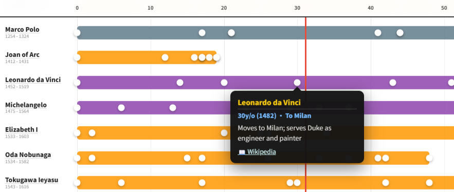
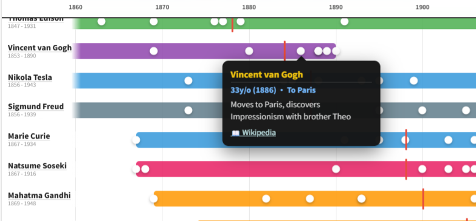

# Age of Greats

**「この年齢のとき、偉人たちは何をしていたのか？」を一瞬で見られるインタラクティブ年表アプリ**

年齢スライダーを動かすか、歴史上の西暦を指定するだけで、アインシュタイン、クレオパトラ、織田信長など50人の偉人たちが、同じ年齢・同じ時代に何をしていたかを一覧できます。

🌐 **[Live Demo → curionlab.github.io/age-of-greats](https://curionlab.github.io/age-of-greats/)**

> English README is available at [README.md](../README.md).

---

## スクリーンショット

| 年齢比較モード | 西暦（カレンダー）モード |
|:---:|:---:|
|  |  |

---

## できること

- **年齢比較モード** — スライダーで自分の年齢を設定。全偉人の年表に赤いラインが引かれ、その年齢で各人が何を達成していたかが一目でわかります。
- **西暦（カレンダー）モード** — 西暦軸に切り替えると、紀元前500年から現代まで、同じ時代に誰が生き、何が起きていたかを俯瞰できます。
- **カテゴリフィルタ** — 科学者・政治リーダー・芸術音楽・テクノロジー・文学・思想家探検家で絞り込み
- **人物名検索** — リアルタイム絞り込み
- **並び替え** — 生年順・名前順・寿命順
- **Wikipedia プレビュー** — 人物名やイベントドットをタップすると、アプリ内でWikipedia概要カードが開きます
- **日本語／英語 UI** — いつでも切り替え可能
- **スマートフォン対応**

---

## ファイル構成

```text
age-of-greats/
├── index.html                  # アプリのエントリポイント
├── package.json                # npm run dev などの簡単コマンド定義
├── merge-data.cjs              # ソースデータから public/data.json を生成
├── build-public.cjs            # アプリ本体を public/ にコピー
├── data.base.json              # ソースJSON（metadata + categories + empty items）
├── data/
│   └── parts/
│       ├── 001.json            # 分割された人物データ
│       ├── 002.json            # 分割された人物データ
│       └── ...                 # 追加の人物データファイル
├── public/                     # 生成される公開用ディレクトリ（直接編集しない）
│   ├── index.html
│   ├── data.json
│   └── docs/
├── .github/
│   └── workflows/
│       └── pages.yml           # GitHub Pages デプロイ workflow
├── docs/
│   ├── README_ja.md            # このファイル
│   ├── screenshot_age.png      # 年齢モードのスクリーンショット
│   └── screenshot_year.png     # 西暦モードのスクリーンショット
├── README.md                   # 英語のREADME
└── LICENSE
```


---
## データ更新方法

このリポジトリでは、ソースデータと生成ファイルを分けて管理します。

- `data.base.json` には `metadata` と `categories` を持たせます
- `data/parts/*.json` に人物データを分割して保存します
- `public/data.json` はビルドで生成されるファイルで、アプリと GitHub Pages で利用します

`public/data.json` は生成物なので、手で直接編集しないでください。

### ソースデータの構造

#### `data.base.json`

```json
{
  "metadata": { "version": "4.0", "title": "...", "languages": ["ja", "en"] },
  "categories": [ ... ],
  "items": []
}
```

#### `data/parts/*.json`

各ファイルは次のどちらかの形式にしてください。

配列形式:

```json
[
  {
    "id": "einstein",
    "category": "science",
    "name": { "ja": "アルベルト・アインシュタイン", "en": "Albert Einstein" },
    "start": 1879,
    "end": 1955,
    "isAlive": false,
    "main_wiki": {
      "ja": "https://ja.wikipedia.org/wiki/アルベルト・アインシュタイン",
      "en": "https://en.wikipedia.org/wiki/Albert_Einstein"
    },
    "events": [
      {
        "age": 26,
        "label": { "ja": "奇跡の年", "en": "Annus Mirabilis" },
        "text": {
          "ja": "特殊相対性理論など4本の論文を発表",
          "en": "Publishes 4 groundbreaking papers including special relativity"
        },
        "wiki": {
          "ja": "https://ja.wikipedia.org/wiki/奇跡の年",
          "en": "https://en.wikipedia.org/wiki/Annus_Mirabilis_papers"
        }
      }
    ]
  }
]
```

または `{ items: [...] }` 形式:

```json
{
  "items": [ ... ]
}
```

### ビルド手順

公開用ファイルをまとめて作るときは、次のコマンドを実行します。

```bash
npm run build
```

このコマンドを実行すると、自動で次のことが行われます。

- アプリ本体を `public/` にコピーする
- `data.base.json` と `data/parts/*.json` をまとめる
- `public/data.json` を生成する

`public/` の中身は生成物なので、直接編集しないでください。

### ローカル開発

手作業でビルドファイルを作る必要はありません。

ターミナルで 1 つコマンドを実行するだけで、ローカルで動かせます。

#### 最初の準備

パソコンに Node.js をインストールしてください。

#### ローカルで起動する

このプロジェクトのフォルダを開き、次のコマンドを実行します。

```bash
npm run dev
```

このコマンドを実行すると、自動で次のことが行われます。

- アプリ本体を `public/` にコピーする
- `data.base.json` と `data/parts/*.json` をまとめる
- `public/data.json` を生成する
- ローカルサーバーを起動する

そのあと、ターミナルに表示された URL をブラウザで開いてください。

#### 学校の先生や非開発者向けの使い方

たとえば授業で新しい歴史人物を追加したいときは、`data/parts/` の JSON ファイルを 1 つ編集してから、次のコマンドを実行するだけです。

```bash
npm run dev
```

難しい操作は不要です。基本は次の 3 ステップです。

1. `data/parts/` に人物データを書く
2. `npm run dev` を実行する
3. ブラウザで開いて授業に使う

#### 大事な注意

- `public/data.json` は自動生成ファイルなので直接編集しません
- 共通設定やカテゴリは `data.base.json` を編集します
- 人物データは `data/parts/*.json` を編集します


### フィールド一覧

| フィールド | 必須 | 説明 |
|---|---|---|
| `id` | ✅ | 全 part ファイルを通して一意の識別子。ハイフンまたはアンダースコアのルールは統一してください。 |
| `category` | ✅ | `categories[].id` に対応する値を指定します。未定義ならマージ時に簡易追加されることがあります。 |
| `name.ja` / `name.en` | ✅ | UI の日英切り替えに使うため、両方必須です。 |
| `start` | ✅ | 生年。紀元前は負の整数を使います。 |
| `end` | ✅ | 没年。必要に応じて存命人物は現在年を使います。 |
| `isAlive` | ✅ | 存命人物なら `true`。 |
| `main_wiki` | ✅ | Wikipedia リンクの正規フィールド名として推奨します。 |
| `events` | ✅ | ライフイベント配列。最低でも誕生と終盤イベント推奨です。 |
| `events[].age` | ✅ | そのイベント時点の年齢です。 |
| `events[].wiki` | ❌ | イベント個別の Wikipedia リンク。任意です。 |

### 年齢と西暦について

イベントは **年齢（age）** ベースで管理します。西暦への変換は `start + age = 西暦` をアプリ側で行います。紀元前人物でも `age` は誕生から数えた非負整数です。

### カテゴリを追加する

新しいカテゴリは `data.base.json` の `categories` に追加してください。

```json
{
  "id": "sports",
  "label": { "ja": "スポーツ", "en": "Sports" },
  "color": "#e74c3c"
}
```

そのうえで、対象人物に `"category": "sports"` を設定します。

### イベント記述ガイドライン

- 最低限 **誕生**（`age: 0`）と終盤イベントを入れてください
- `label` は短く保ってください
- `text` は1〜2文程度を目安にします
- `ja` と `en` の両方を必ず記入してください
- `wiki` は任意ですが推奨です
- 紀元前人物でも `age` は非負整数で記入します


## コントリビュートについて（プルリク歓迎！）

以下のPRを歓迎します：

- 新しい偉人の追加
- 既存人物へのイベント追加
- 事実誤りの修正
- 日英翻訳の改善

**手順：**

1. 人物データは `data/parts/*.json` に追加または更新する
2. `data.base.json` は共有 metadata や category の変更時だけ編集する
3. `public/data.json` は生成物なので手動編集しない
4. `events[].wiki` または PR 本文にソース URL を記載する
5. `name`・`label`・`text` には日英両方のテキストを入れる
6. `id` は全 part ファイルを通して重複しないようにする
7. PR は1人単位、または小さなテーマ単位にまとめるとレビューしやすいです

> イベント内容に確信がない場合は、Draft PR で相談しながら進めてください。


## データ追加テンプレート（コピペ用）

<details>
<summary>人物追加テンプレート</summary>

```json
[
  {
    "id": "your-id-here",
    "category": "science",
    "name": { "ja": "日本語名", "en": "English Name" },
    "start": 1900,
    "end": 1980,
    "isAlive": false,
    "main_wiki": {
      "ja": "https://ja.wikipedia.org/wiki/...",
      "en": "https://en.wikipedia.org/wiki/..."
    },
    "events": [
      {
        "age": 0,
        "label": { "ja": "誕生", "en": "Birth" },
        "text": { "ja": "...", "en": "..." }
      },
      {
        "age": 25,
        "label": { "ja": "代表作", "en": "Key Work" },
        "text": { "ja": "...", "en": "..." },
        "wiki": { "ja": "...", "en": "..." }
      },
      {
        "age": 80,
        "label": { "ja": "死去", "en": "Death" },
        "text": { "ja": "...", "en": "..." }
      }
    ]
  }
]
```

</details>

---

## ライセンス

[Apache License 2.0](../LICENSE)

Copyright (c) 2026 Curion Lab

---

*プルタルコスの『対比列伝』の精神を受け継いで — 時代を超えた偉人たちを同じ軸で比較する。*
